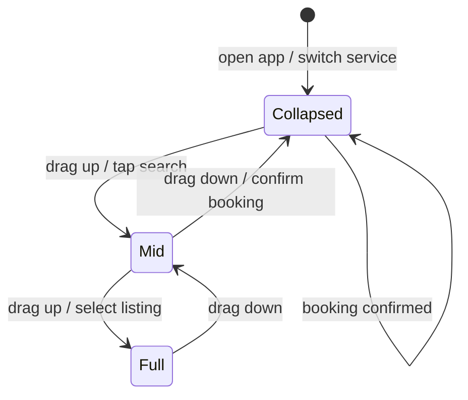
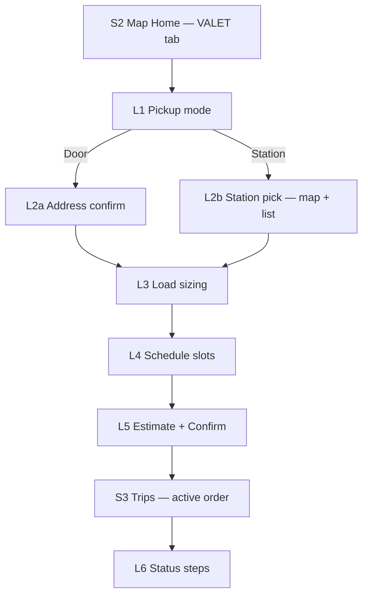
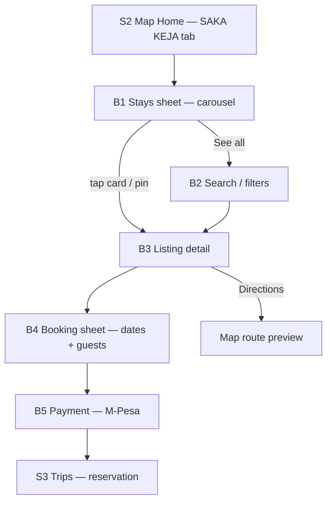
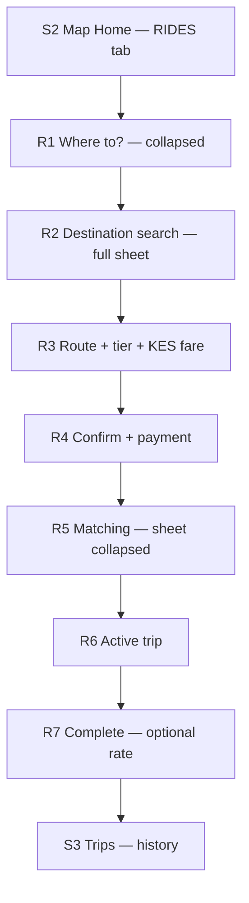
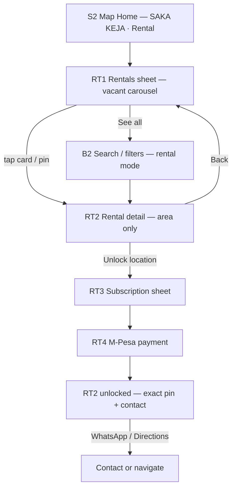
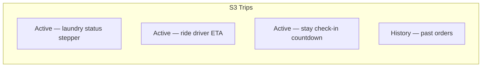
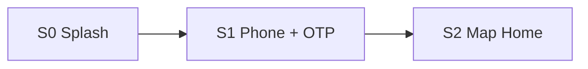

# Jua X — UI Specifications (MVP)

Design reference for implementing a **minimalistic, map-first, highly interactive** super-app. This document defines the screens, flows, and interaction patterns required for MVP — informed by Uber, Bolt, on-demand laundry apps, Airbnb, and Kenya-market apps (Little, SafeBoda, Sendy).

**MVP priority (ship in this order):**

1. **Jua Fua / VALET** — laundry pickup (door or station)
2. **Saka Keja** — short stays (BNBs) + Kisumu pilot rentals (Phase 2)
3. **Rides** — book a trip

Everything else (Rentals, Explore, Inbox, valet studio, ride planner, 3D tours) is **post-MVP**.

**Related docs:** [README.md](./README.md) · [IMPLEMENTATION.md](./IMPLEMENTATION.md)

---

## 1. Design philosophy

### What “minimalistic + interactive” means for Jua X

| Principle | Source inspiration | Jua X rule |
|-----------|-------------------|------------|
| **Map-first** | Uber, Bolt, Sendy | The map is never hidden during booking. UI floats on top. |
| **One sheet, many states** | Bolt (lean chrome), Fabric Spa laundry | Use a bottom sheet state machine — not a new screen per step. |
| **Destination / intent first** | Uber (Lyft shift), Bolt | Within a service, ask *what* before *how* (where to → tier; load → schedule). |
| **Progressive disclosure** | Airbnb checkout | One primary decision per sheet expansion. Extras live behind “More” or deep pages. |
| **Upfront price in KES** | Bolt, SafeBoda, Laundrapp | Show KES total before confirm. No surprise fees at payment. |
| **Phone-first, Kenya-native** | Little, M-Pesa ecosystem | +254 OTP auth, M-Pesa STK, SMS/WhatsApp confirmations — not email wizards. |
| **Visual load sizing** | Rinse, Washio | kg stepper or 2 bag sizes — not a 40-item catalog at MVP. |
| **Photo-first stays** | Airbnb | Gallery drives intent; amenities as icon chips, not paragraphs. |
| **Repeat in 2 taps** | Uber recents | Recents and “book again” on Home collapsed sheet. |

### What we deliberately avoid (MVP)

- Mode-first ride booking (pick car type before destination) — friction Little Cab moved away from
- Generic “errand” laundry (Glovo “Anything”) — Jua Fua deserves a dedicated flow
- Full Airbnb filter matrix (40+ filters, flexible dates, messaging inbox)
- Separate app per service — one map shell, tab-switched content
- Splash/promo on every return visit — straight to map for authed users

---

## 2. Competitive research summary

### Rides — Uber vs Bolt

| Aspect | Uber | Bolt | Jua X MVP takeaway |
|--------|------|------|-------------------|
| Entry | Map + “Where to?” | Same, less chrome | Copy Bolt’s visual simplicity |
| Full flow | ~15 screens | ~6–7 essential screens | Target **6–7 states**, one map shell |
| Pricing | Upfront per tier | Upfront per tier | KES fare on route preview sheet |
| Matching | Skeleton + animated route | Similar, lighter UI | Collapsed sheet + map dominant |
| Extras | Tips, chat, promos, multi-modal | Fewer cross-sells | **Defer** tips, chat, schedule, multi-stop |
| Kenya note | Cash + card | Cash + card | **M-Pesa primary** at confirm |

**Bolt wins for MVP UI target:** same map + sheet choreography, flatter hierarchy, single confirm CTA.

### Laundry — Washio, Rinse, Laundrapp

| App | Core pattern | MVP lesson |
|-----|--------------|------------|
| **Washio** | Pickup + delivery windows on **one** order screen | Combine schedule fields; avoid 5-step wizard |
| **Rinse** | 2 visual bag sizes, flat price | Bag/kg metaphor beats item picker |
| **Laundrapp** | Postcode → item list → slot bands | Item catalog = **post-MVP** |
| **Fabric Spa** (case study) | 3 steps: service → schedule → confirm; **day chips** not full calendar | Use horizontal day chips + 2–4 time bands |

**Station vs door:** Kenya ops benefit from a **segment toggle** (door | station) with map pins for stations — already in the prototype.

### Stays — Airbnb (“Saka Keja”)

| Aspect | Airbnb full app | Kenya market (bnb.co.ke, hosts) | Jua X MVP |
|--------|-----------------|--------------------------------|-----------|
| Search | Where / When / Who | Often WhatsApp “Book now” | In-app: area + dates + guests |
| Checkout | Progressive screens | M-Pesa to host till | STK Push + booking summary |
| Trust | Reviews, Superhost, 3D | Real photos, map pin, stars | Photo gallery + map + rating chip |
| Messaging | In-app inbox | WhatsApp | **WhatsApp CTA** acceptable at MVP |

**Saka Keja** = short stays / BNBS tab. Swahili street term for “get a place” — same UX job as Airbnb instant book, localized.

**Kisumu pilot** — Saka Keja also serves **long-term rentals** (vacant apartments) for visitors relocating or staying weeks/months. Exact rental locations are **subscription-gated**; BnBs use **book-to-reveal** address. Full case study: **§5.2.1**.

### Kenya super-app context

| App | Relevant pattern |
|-----|------------------|
| **Little** | Super-app hub; schedule ride later; fare before hail — adopt schedule **post-MVP** |
| **SafeBoda** | Flat price, M-Pesa wallet, emergency/share trip — adopt for ride trust **post-MVP** |
| **Sendy** | Map → quote → vehicle → track — reuse for courier-style pickup legs **post-MVP** |
| **Glovo** | Laundry via partner store, not dedicated flow — **do not** copy for Jua Fua |

---

## 3. MVP scope

### In scope

| Area | Screens / states |
|------|------------------|
| Auth | Splash, phone OTP sign-in |
| Shell | Map Home, 3 service tabs, bottom sheet, tab bar (Home · Trips · Me) |
| Laundry | L1–L6 (below) |
| Saka Keja | B1–B6 (below) |
| Rides | R1–R7 (below) |
| Trips | Unified active + history |
| Profile | Name, phone, payment method, theme |

### Post-MVP (do not design/build yet)

| Area | Reason to defer |
|------|-----------------|
| **Rentals** tab | Long-term housing ≠ saka keja urgency |
| **Explore** tab | Discovery lenses, journal, heat maps |
| **Inbox** tab | Static demo today; real messaging later |
| Valet studio (mama fua at home) | Premium upsell after core laundry works |
| Ride planner (stops, luggage, meet & assist) | Bolt/Uber post-MVP extras |
| 3D tours (Matterport) | Airbnb parity, not MVP |
| Live driver/valet tracking map | Matching state + SMS sufficient for MVP |
| Subscriptions, itemized laundry catalog | Laundrapp-depth |
| **Rental segment + location subscriptions** | Phase 2 — after BnB pilot in Kisumu (see **§5.2.1**, **§5.4**) |

### Kisumu pilot — phased rollout

| Phase | Scope | Ship when |
|-------|--------|-----------|
| **Phase 1** | Saka Keja **BnB** only — proximity search, Kisumu listings, book-to-reveal address | MVP launch |
| **Phase 2** | **Rental** segment on same map + daily/weekly/monthly subscription to unlock exact locations | After BnB ops stable |
| **Phase 3** | Multi-city scale, landlord dashboard, featured listings | Post-pilot |

### MVP tab bar (3 tabs)

```
┌─────────┬─────────┬─────────┐
│  Home   │  Trips  │   Me    │
└─────────┴─────────┴─────────┘
```

Explore and Inbox are removed from MVP chrome. **Rentals** ship as a **segment inside Saka Keja** (BnB | Rental toggle) in Phase 2 — not a separate top-level tab.

---

## 4. Global shell — map-first home

### Layout anatomy

```
┌──────────────────────────────────────┐
│  Status bar                          │
├──────────────────────────────────────┤
│                                      │
│           MAP (full bleed)           │
│     pins · route · user dot          │
│                          [◎] [⌖]    │  ← map FABs (recenter, fit)
│                                      │
├──────────────────────────────────────┤
│  ┌ VALET │ SAKA KEJA │ RIDES ┐      │  ← service segment (3 only MVP)
├──────────────────────────────────────┤
│  ▔▔▔  drag handle                    │
│  BOTTOM SHEET (collapsed | mid | full)│
│  … flow content …                    │
├──────────────────────────────────────┤
│  Home    Trips    Me                   │
└──────────────────────────────────────┘
```

### Bottom sheet state machine



| State | Height | Content |
|-------|--------|---------|
| **Collapsed** | ~22–28% screen | Service context, primary CTA, 1-line status |
| **Mid** | ~45–55% | Search, options, tier/list cards |
| **Full** | ~85–92% | Listing detail, schedule picker, payment review |

**Rule:** Never navigate away from the map for a booking step unless opening **payment WebView** or **full-screen gallery**.

### Service segment (MVP)

| Key | Label | Map pins |
|-----|-------|----------|
| `laundry` | **VALET** | Jua Fua stations |
| `bnbs` | **SAKA KEJA** | Stay listings (BnB + Rental pins when Phase 2 on) |
| `rides` | **RIDES** | Route + destination (no listing pins) |

**Saka Keja sub-segment (Phase 2+)** — inside the SAKA KEJA tab only:

| Key | Label | Map pins |
|-----|-------|----------|
| `bnb` | **BnB** | Short-stay listings (nightly KES) |
| `rental` | **Rental** | Vacant long-term units (monthly KES) |

---

## 5. Screen inventory — MVP

### 5.0 Shared / shell screens

| ID | Screen | Purpose | Key elements |
|----|--------|---------|--------------|
| **S0** | Splash | Brand moment (first launch only) | Logo, “Jua X”, single CTA |
| **S1** | Phone sign-in | Auth | +254 phone, OTP input, name (first time) |
| **S2** | Map Home | App root | Map, segment, sheet collapsed, tab bar |
| **S3** | Trips | Unified orders | Active card (top) + history list |
| **S4** | Profile (Me) | Account | Avatar, phone, M-Pesa chip, theme toggle |

---

### 5.1 Laundry / Jua Fua flow (PRIORITY 1)

**Job:** Pick up dirty laundry (door or station) → size load → pick slot → pay → track status.



| ID | Screen / sheet state | Interaction spec | Primary CTA |
|----|---------------------|------------------|-------------|
| **L1** | Pickup mode | Segmented control: **Door** \| **Station**. Copy: “Pickup, then load.” | — |
| **L2a** | Door address | Auto GPS address block; tap to refine on map. Show county pill. | Continue |
| **L2b** | Station pick | List synced to map pins; tap pin or row selects station; highlight ring on map. | Continue |
| **L3** | Load sizing | Toggle **kg** \| **items**; stepper (default 4 kg). Optional: 2 bag presets (Flex / Full) like Rinse. | Continue |
| **L4** | Schedule | Horizontal **day chips** (Today, Tomorrow, +5 days) + **2–4 time bands** (Morning, Afternoon, Evening). No full calendar. | Continue |
| **L5** | Estimate + confirm | KES line items (load × rate); M-Pesa payment chip; one **Confirm request** button. | Confirm request |
| **L6** | Tracking (in Trips) | Stepper: **Requested → Pickup scheduled → Collected → Ready → Delivered**. SMS/WhatsApp copy optional. | View in Trips |

**Micro-interactions**

- Switching Door ↔ Station updates map pins without WebView reload (existing `juaApplyHomeMode` pattern).
- KES estimate updates live as stepper changes (`LAUNDRY_KES_PER_KG` / per item).
- On confirm: sheet collapses, brief toast, switch to Trips tab.

**Cut from prototype for MVP**

| Keep | Defer |
|------|-------|
| Segment toggle, kg/items, estimate bar, confirm | `valet-studio` deep page |
| Station list + map sync | Live navigation to station |
| Schedule slots (**add** — gap in prototype) | Per-item Laundrapp catalog |

---

### 5.2 Saka Keja / BNB flow (PRIORITY 2)

**Job:** Discover a short stay near user → view listing → pick dates/guests → pay → get confirmation.



| ID | Screen / sheet state | Interaction spec | Primary CTA |
|----|---------------------|------------------|-------------|
| **B1** | Stays sheet (mid) | Featured carousel (3 cards), county context, “Near you” chips. Map pins for same listings. | See all |
| **B2** | Search / filters (full) | Area (county / near me), **dates** (range bottom sheet), **guests** stepper. Map optional split view post-MVP. | Apply |
| **B3** | Listing detail (full) | Photo gallery swipe, title, **KES / night**, rating, 5 amenity icon chips + “+N more”, map pill, host snippet. Sticky bottom bar. | Reserve |
| **B4** | Booking sheet | Check-in / check-out, guests, **price breakdown** (nights × rate + cleaning fee = **total KES**). Progressive: one screen, not 4. | Continue to pay |
| **B5** | Payment | M-Pesa STK (primary); saved number; confirm spinner. Fallback: WhatsApp host with prefilled message. | Pay & book |
| **B6** | Confirmed (Trips) | Booking ID, dates, address, **Get directions**, WhatsApp host. | — |

**Micro-interactions**

- Tap map pin → mini preview card → tap again → B3 (existing WebView `postMessage` pattern).
- Gallery: full-screen swipe; no 3D tour button at MVP.
- Sticky **Reserve** bar appears after user scrolls past hero on B3 (Airbnb pattern).

**Cut from prototype for MVP**

| Keep | Defer |
|------|-------|
| Carousel, listing detail, map pins, confirm | 3D tour modal |
| County filter | `listings` deep catalog page (use B2 instead) |
| — | Reviews write, request-to-book, in-app chat |
| **Add:** B4 dates/guests + fee breakdown | Flexible dates, long-stay discounts |

---

### 5.2.1 Kisumu pilot — case study & product rules

**Problem:** Kisumu receives many visitors who lack local networks. They need a **BnB** (nights) or a **rental apartment** (weeks/months). Listings are scattered across WhatsApp and agents; locations stay hidden until money changes hands; trust is low.

**Job to be done:** *“Nipe keja karibu na mimi”* — find a place near where I am, compare price and photos, then unlock the real location when it is fair.

**Case study narrative (design + copy reference):**

> A visitor lands in Kisumu with no local contacts. They open Jua X, tap **Saka Keja**, and the map shows BnBs and vacant rentals within 5 km. They compare photos and prices in Milimani and Riat without seeing exact street addresses. For a weekend stay, they book a BnB via M-Pesa and receive the full address on confirmation (B6). For a month-long stay, they buy a **weekly subscription**, unlock exact pins for three apartments, WhatsApp the landlords, and view one in person — without an agent.

#### Location visibility model

| Field | Free (all users) | BnB (after M-Pesa book) | Rental (active subscription) |
|-------|------------------|-------------------------|------------------------------|
| Photos, price, beds, amenities | Yes | Yes | Yes |
| Neighborhood / estate name | Yes | Yes | Yes |
| Approximate map pin (offset ~200–500 m) | Yes | Yes | Yes |
| Exact address + building name | No | **Yes** (B6) | **Yes** |
| Directions + landlord contact | No | **Yes** (B6) | **Yes** |

**Rules**

- **BnB:** never charge a browse subscription — **book-to-reveal** only (pay at B5 → address on B6).
- **Rental:** show **vacant only**; exact location + contact require an active subscription (RT3).
- **Proximity default:** GPS “Near you” + radius chips **2 km · 5 km · 10 km** (Kisumu pilot default **5 km**).
- **Pilot filter:** admin can restrict listings to **Kisumu county** only.

#### Subscription tiers (rental location unlock)

| Plan | Swahili positioning | Duration | Unlocks |
|------|---------------------|----------|---------|
| **Daily** | “Leo tu — tafuta keja leo” | 24 h | Exact rental pins + contacts |
| **Weekly** | “Wiki moja — angalia kila mahali” | 7 d | Same |
| **Monthly** | “Mwezi mzima — unlock everything” | 30 d | Same |

Payment: M-Pesa STK (same pattern as B5). Subscription does **not** replace BnB booking payment.

#### Admin toggles (ops)

| Setting | Default (pilot) | Effect |
|---------|-----------------|--------|
| Require subscription for exact **rental** locations | **ON** | Free users see area + price only |
| Require subscription for exact **BnB** locations | **OFF** | Address after booking only |
| Default search radius (km) | **5** | Initial map filter |
| Kisumu-only listings | **ON** (pilot) | Hide other counties |

Landlord/admin listing fields: title, photos, beds, furnished Y/N, price (nightly or monthly), neighborhood, approximate coords, exact address (gated), contact (gated), **vacant** badge (rentals).

#### Revenue streams (pilot)

| Stream | Trigger |
|--------|---------|
| BnB commission / booking fee | Per reservation (B5) |
| Rental location subscription | Daily / weekly / monthly STK |
| Featured listing (later) | Landlord pays for carousel priority |

---

### 5.3 Ride flow (PRIORITY 3)

**Job:** Set destination → see route + fare → pick tier → pay → match → trip.



| ID | Screen / sheet state | Interaction spec | Primary CTA |
|----|---------------------|------------------|-------------|
| **R1** | Map + collapsed sheet | Pickup auto from GPS; search field **“Where to, Jua?”**; 2–3 recent destinations as chips. | — |
| **R2** | Destination search (full) | Mapbox autocomplete, recents, saved places. Kenya bias (`country=ke` when query matches). | Select destination |
| **R3** | Product + fare (mid) | Route drawn on map; **3 tiers** (Jua X Ride / Comfort / XL); **KES** fare + ETA per tier; skeleton while route loads. | Select tier |
| **R4** | Confirm | Pickup summary, destination, tier, **KES total**, M-Pesa/cash chip. | Confirm ride |
| **R5** | Matching | Sheet collapsed; map shows route; pulsing “Finding your driver…”; optional skeleton cars (Uber pattern). | Cancel |
| **R6** | Active trip | Collapsed driver card: name, plate, ETA; expand for call/WhatsApp. Map dominant. | — |
| **R7** | Complete | Fare paid, optional 5-star rate (skippable). | Done → Trips |

**Micro-interactions**

- Route + fare fetch on destination select (existing `fetchRouteEstimate`).
- Tier tap updates fare instantly (multiplier on distance).
- Currency must be **KES**, not USD (prototype gap).

**Cut from prototype for MVP**

| Keep | Defer |
|------|-------|
| Search, tiers, route preview, confirm | `rides-planner` (stops, luggage, meet & assist) |
| Trips history entry | In-app turn-by-turn (WebView preview → Navigation SDK) |
| Recents in R1 | Schedule ride, boda tier, tips, driver chat |

---

### 5.4 Saka Keja — Rental segment + subscription (Phase 2)

**Job:** Discover **vacant** rentals near user → compare monthly rent → subscribe → unlock exact location → contact landlord.

**Prerequisite:** User is on **S2 Map Home → SAKA KEJA tab** with sub-segment **Rental** selected.



| ID | Screen / sheet state | Interaction spec | Primary CTA |
|----|---------------------|------------------|-------------|
| **RT1** | Rentals sheet (mid) | Sub-segment **BnB \| Rental** at top of stays sheet. Carousel of **vacant** units only; **KES / month**; **Vacant** badge; neighborhood chip. Map pins synced (approximate until subscribed). Radius chips: 2 · 5 · 10 km. | See all |
| **RT2** | Rental detail (full) | Photo gallery, title, **KES / month**, beds, furnished chip, amenity icons. Map pill shows **neighborhood only** + blurred/offset pin. Locked rows: exact address, landlord name, WhatsApp — with lock icon. If subscription active: rows unlock, pin snaps to exact coords. Sticky bar. | **Unlock location** (or **Contact landlord** if subscribed) |
| **RT3** | Subscription sheet | Three plan cards: Daily / Weekly / Monthly with KES price + Swahili tagline. Bullet: “Unlock all rental locations in Kisumu.” Selected plan highlighted. | Continue to pay |
| **RT4** | Subscription payment | M-Pesa STK (masked `07XX *** XX`); spinner “Sending STK push…”; success → toast “Location unlocked” + return to RT2 unlocked. | Pay & unlock |
| **RT5** | Subscription active (Me / banner) | Small chip on Profile or sheet header: “Unlocked until **12 Jun**” with plan name. Tap → renewal. | Renew |
| **RT6** | Admin — Saka Keja settings | Toggles: rental location gate, BnB location gate, default radius, Kisumu-only. Listing CRUD: mark vacant/occupied, upload photos, set rent. | Save |

**Micro-interactions**

- Switching **BnB ↔ Rental** updates map pin set without WebView reload (same pattern as Door ↔ Station).
- Unsubscribed user tapping locked address row → RT3 (not error toast).
- Subscribed user: map pin animates from offset to exact location (subtle, ~300 ms).
- **Vacant** filter is always on for rental mode — occupied units never appear.

**BnB sheet updates (Phase 1 + 2)**

| Screen | Add |
|--------|-----|
| **B1** | Proximity chips (2 · 5 · 10 km); “Near you in Kisumu” header when pilot on |
| **B2** | Radius + dates/guests (BnB) or radius + furnished filter (Rental) |
| **B3** | Map pill: approximate pin pre-book; exact after book on B6 only |

**Cut for Phase 2 pilot**

| Keep | Defer |
|------|-------|
| RT1–RT4, admin toggles (RT6), vacant-only | Lease signing, viewing scheduler, deposit escrow |
| M-Pesa subscription STK | Auto-renew, family plans |
| WhatsApp landlord CTA | In-app landlord messaging |

---

## 6. Trips tab — unified order model

One list for all services. MVP card types:



| Card type | Top line | Subline | Action |
|-----------|----------|---------|--------|
| Laundry active | `Jua Fua · 6 kg · Westlands` | Status: **Collected** | Tap → L6 detail |
| Ride active | `Jua X Comfort · CBD` | Driver **4 min** away | Tap → R6 |
| Stay upcoming | `Saka Keja · Nyali Studio` | Check-in **Fri 2 PM** | Tap → B6 |
| Rental subscription active | `Saka Keja · Weekly unlock` | Expires **Fri 12 Jun** | Tap → RT5 |
| History | Service summary | Date · **Completed** | Tap → receipt stub |

**Empty state:** “No trips yet — book from Home.”

---

## 7. UI component library (MVP)

Reusable patterns across flows:

| Component | Spec | Used in |
|-----------|------|---------|
| **Map shell** | Full-bleed WebView; theme-aware style (`light-v11` / `dark-v11`) | S2, all flows |
| **Service segment** | 3 pills, equal width, active = filled | S2 |
| **Bottom sheet** | Drag handle 36×4px; 3 snap points; backdrop none (map visible) | S2 |
| **Search field** | Rounded, map icon, clear button | R2, B2 |
| **KES estimate bar** | Label left, amount right, `Inter_600` | L5, R3, B4 |
| **Primary CTA** | Full width, 54px min height, one per sheet state | All confirms |
| **Stepper** | − / value / + for kg, guests | L3, B4 |
| **Day chips** | Horizontal scroll, selected = accent border | L4 |
| **Tier row** | Icon, name, KES, ETA; checkmark when selected | R3 |
| **Status stepper** | 4–5 dots or labeled steps | L6, Trips |
| **Listing card** | 16:9 image, title, KES, rating chip | B1, B2 |
| **Sticky reserve bar** | Blur/surface, price + CTA, safe area bottom | B3 |
| **Payment chip** | M-Pesa logo + masked phone | L5, R4, B5 |
| **Toast** | 3s, bottom above tab bar | After confirm |

### Typography (existing)

- **Inter** — 400 body, 500 labels, 600 prices/CTAs, 700 titles
- Title: 22–28px; body: 14–15px; muted: `textSecondary`

### Color (existing themes)

- Light canvas `#F2F2F0`; dark canvas `#0F1115`
- Accent blue for routes/links `#2563EB` / `#3B82F6`
- One primary CTA per view — no competing buttons

---

## 8. Auth flow (MVP)



| Step | UI |
|------|-----|
| Splash | First launch only; returning users → S2 |
| Phone | `+254` prefix fixed; 9-digit input; OTP 6 boxes |
| Name | First-time only, single field |
| Error | Inline under field; no modal |

Replace prototype `+880` and mock non-editable inputs.

---

## 9. Flow comparison — taps to book

Target tap count (new user, good GPS):

| Flow | Taps | Path |
|------|------|------|
| Laundry (door) | 5 | VALET → Door → kg → slot → Confirm |
| Laundry (station) | 6 | VALET → Station → pick hub → kg → slot → Confirm |
| Saka Keja (BnB) | 6 | Pin → Reserve → dates/guests → Pay → Done |
| Saka Keja (Rental + sub) | 5 | Pin → Unlock → pick plan → Pay → Contact |
| Ride | 5 | RIDES → search dest → tier → Confirm → Done |
| Repeat ride | 2 | Recent chip → Confirm |

---

## 10. Map to current prototype (`App.tsx`)

| MVP spec | Prototype today | Action |
|----------|-----------------|--------|
| S0 Splash | `renderSplash` | Keep |
| S1 Auth | `renderSignIn` mock | **Rebuild** — real phone/OTP UI |
| S2 Map Home | `renderHome` | Keep shell; add BnB \| Rental sub-segment in Phase 2 |
| 3-tab bar | 5 tabs | **Remove** Explore, Inbox from MVP |
| L1–L3 Laundry | VALET sheet | Keep; polish |
| L4 Schedule | Missing | **Add** day chips + bands |
| L5 Confirm | `Confirm request` | Keep; wire M-Pesa placeholder |
| B1 Carousel | BNBS sheet | Keep |
| B3 Listing detail | `homeDeepPage listing-detail` | Keep |
| B4 Dates/guests | Missing | **Add** before confirm |
| R1–R3 Rides | RIDES sheet | Keep; **KES** not USD |
| R4–R7 Post-confirm | `tripFeed` string only | **Add** status states |
| S3 Trips | `renderTrips` | **Upgrade** to typed cards |
| S4 Profile | `renderProfile` | Keep; real user data later |
| Valet studio | `valet-studio` deep page | Post-MVP |
| Ride planner | `rides-planner` deep page | Post-MVP |
| Rental segment + RT1–RT4 | `houses` service | **Phase 2** — segment inside Saka Keja |
| Admin RT6 | — | **Phase 2** — web or hidden admin screen |
| Explore tab | `renderExplore` | Post-MVP |

---

## 11. Payment & confirmation (MVP UI only)

No backend in prototype — UI should still show:

| Moment | UI |
|--------|-----|
| Pre-confirm | M-Pesa chip on estimate bar (masked `07XX *** XX`) |
| Confirm tap | Full-screen or sheet spinner: “Sending STK push…” |
| Success | Sheet collapses + toast “Booked” + navigate Trips |
| Failure | Inline retry + “Try cash” secondary (rides only) |

WhatsApp fallback (saka keja): `wa.me/{host}?text=Booking…` link on B6.

---

## 12. Accessibility & performance (MVP)

| Concern | Spec |
|---------|------|
| Touch targets | Min 44×44pt for all tappable elements |
| Sheet drag | Handle + swipe from sheet body |
| Loading | Skeleton on fare/route; never blank sheet |
| 3G Kenya | Unsplash images lazy; map token required for live map |
| Location denied | Inline banner + manual county picker |
| Dark mode | Both themes for all MVP screens (existing toggle) |

---

## 13. Post-MVP screen backlog

| Flow | Screens to add later |
|------|---------------------|
| Rentals+ | Viewing scheduler, lease terms, deposit escrow |
| Subscriptions+ | Auto-renew, promo codes, family plans |
| Explore | Lens filters, journal, heat map key |
| Inbox | Thread list, push notification deep links |
| Laundry+ | Valet studio, subscriptions, photo inventory |
| Rides+ | Planner, schedule, boda tier, live nav SDK |
| Stays+ | 3D tour, reviews, request-to-book, host dashboard |

---

## 14. Design deliverables checklist

For designers / implementers before coding MVP:

- [ ] Wireframes: S2 shell + L1–L6 + B1–B6 + R1–R7 (mobile 390×844)
- [ ] Wireframes (Phase 2): RT1–RT5 rental + subscription + RT6 admin toggles
- [ ] Kisumu pilot copy deck: proximity chips, subscription taglines, locked-location states
- [ ] Component specs: sheet snap heights, segment, CTA, cards
- [ ] Copy deck: Kenya English + key Swahili labels (Saka Keja, Jua Fua)
- [ ] Icon set: service segment, amenity chips, payment, status steps
- [ ] M-Pesa + WhatsApp brand assets (official guidelines)
- [ ] Empty / error / loading states per screen ID
- [ ] Dark mode pass on all MVP screens

---

## 15. Figma generation prompt — Saka Keja Kisumu pilot

Copy everything inside the block below into Figma (AI generate, MCP `use_figma`, or designer brief). Target **mobile 390×844**, light + dark variants.

```
DESIGN BRIEF: Jua X — Saka Keja (Kisumu pilot)
Product: Kenya super-app, map-first stays discovery for visitors in Kisumu.
Tagline context: "Powered by Jua Fua laundry and city services."
Service name: SAKA KEJA (Swahili — "get a place").

DESIGN LANGUAGE
- Map-first shell: full-bleed Mapbox map, floating UI on top (Uber/Bolt pattern).
- Bottom sheet with 3 snap states: collapsed (~25%), mid (~50%), full (~90%).
- Font: Inter (Regular 400, Medium 500, Semi Bold 600, Bold 700).
- Primary CTA: dark pill #111827, white text, 44pt min touch target.
- Accent for stays: warm amber/orange pins #F59E0B, stroke #EA580C.
- Rental accent: distinct pin color (e.g. teal #0D9488) vs BnB amber.
- Currency: KES everywhere (e.g. "KES 3,500 / night", "KES 18,000 / month").
- Kenya-native: +254 phone patterns, M-Pesa green chip, WhatsApp green secondary CTA.
- Dark mode: full pass on every screen.
- Minimal chrome — progressive disclosure, one primary CTA per sheet state.

GLOBAL SHELL (S2)
- Top: status bar.
- Center: Kisumu map with listing pins (approximate offset pins for locked; exact for unlocked).
- Bottom sheet over map.
- Top service segment (3 tabs): VALET | SAKA KEJA | RIDES — SAKA KEJA selected.
- Inside Saka Keja sheet header: sub-segment toggle BnB | Rental.
- Proximity chips row: "Near you" · 2 km · 5 km · 10 km (5 km selected).
- Tab bar: Home · Trips · Me.

PHASE 1 SCREENS — BnB (generate all)

B1 — Stays sheet (mid snap)
- Header: "Near you in Kisumu"
- Horizontal carousel: 3 stay cards (photo, title, KES/night, rating star, neighborhood).
- Map pins match carousel.
- CTA: "See all"
- Sample listing: "Milimani Garden Studio · KES 4,200 / night · ★ 4.8"

B2 — Search / filters (full snap)
- Area: Kisumu + near me
- Date range picker (check-in / check-out)
- Guests stepper
- Apply button

B3 — Listing detail (full)
- Swipeable photo gallery hero
- Title, KES/night, rating, 5 amenity icon chips + "+3 more"
- Map pill: neighborhood "Milimani" with approximate pin (slightly offset from true location)
- Host snippet (avatar + first name)
- Sticky bottom bar: "Reserve" (primary)

B4 — Booking sheet
- Check-in / check-out dates
- Guests count
- Price breakdown: nights × rate + cleaning fee = TOTAL KES
- CTA: "Continue to pay"

B5 — Payment
- M-Pesa STK primary (masked 07XX *** XX)
- Spinner state: "Sending STK push…"
- CTA: "Pay & book"

B6 — Confirmed (Trips card + detail)
- Booking ID, dates, FULL exact address (unlocked after payment)
- "Get directions" + "WhatsApp host" buttons
- Sample: "Saka Keja · Milimani Garden Studio · Check-in Fri 2 PM"

PHASE 2 SCREENS — Rental + subscription (generate all)

RT1 — Rentals sheet (mid snap)
- Sub-segment: BnB | Rental (Rental selected)
- "Vacant near you" header
- Carousel: rental cards with VACANT badge, KES/month, beds, neighborhood
- Only vacant units; no occupied
- Sample: "Riat 2BR Apartment · KES 22,000 / month · Vacant · Furnished"

RT2 — Rental detail LOCKED state (full)
- Photo gallery, title, KES/month, beds, furnished chip
- Map pill: neighborhood only, offset/blurred pin
- Locked rows with lock icons: "Exact address", "Landlord contact", "WhatsApp"
- Sticky CTA: "Unlock location"

RT2 — Rental detail UNLOCKED state (separate frame)
- Same layout but: exact address visible, pin at true location, landlord name + WhatsApp button
- Sticky CTA: "Contact landlord" (WhatsApp green)
- Subtle visual: pin moved from offset to exact (show transition annotation)

RT3 — Subscription sheet
- Title: "Unlock rental locations"
- Subtitle: "See exact addresses and contact landlords in Kisumu"
- 3 plan cards:
  1. Daily — "Leo tu — tafuta keja leo" — KES [price] / 24h
  2. Weekly — "Wiki moja — angalia kila mahali" — KES [price] / 7 days (recommended badge)
  3. Monthly — "Mwezi mzima — unlock everything" — KES [price] / 30 days
- Bullets: all rental pins, directions, WhatsApp contacts
- CTA: "Continue to pay"

RT4 — Subscription payment
- Selected plan summary
- M-Pesa STK
- Success toast: "Location unlocked"
- CTA: "Pay & unlock"

RT5 — Active subscription chip
- Small banner/chip: "Unlocked until 12 Jun · Weekly"
- Placement: Profile (Me tab) or rental sheet header

RT6 — Admin settings (simple mobile admin or tablet)
- Toggles:
  - "Require subscription for rental locations" ON
  - "Require subscription for BnB locations" OFF
  - "Kisumu-only listings" ON
  - Default radius: 5 km stepper
- Listing row: photo thumb, title, Vacant toggle, KES/month field

TRIPS TAB ADDITIONS
- Stay upcoming card (BnB): as B6
- Rental subscription card: "Saka Keja · Weekly unlock · Expires Fri 12 Jun"

STATES TO INCLUDE (component variants)
- Bottom sheet: collapsed / mid / full
- Map pin: BnB amber · Rental teal · approximate (dashed ring) · exact (solid)
- Locked vs unlocked content rows
- M-Pesa: idle · loading spinner · success
- Empty: "No vacant rentals near you — try 10 km"
- Location denied banner + manual Kisumu area picker
- Light + dark mode for every screen above

LAYOUT RULES
- Never hide the map during booking — sheet floats on top.
- Photo-first cards (Airbnb pattern).
- One primary decision per sheet expansion.
- Sticky CTA bars on detail screens.
- Min 44×44pt touch targets.

DELIVERABLE
- Figma page: "Saka Keja — Kisumu Pilot"
- Frames labeled: B1, B2, B3, B4, B5, B6, RT1, RT2-locked, RT2-unlocked, RT3, RT4, RT5, RT6, S2-shell
- Include a user-flow connector diagram (BnB path + Rental subscription path)
- 390×844 iPhone frames, 8px spacing grid, 12–16px card radius
```

**Cursor / Figma MCP:** To build in Figma from this repo, run `/figma-create-new-file` design `Jua X — Saka Keja Kisumu`, then paste this brief with `/figma-generate-design` and the target file URL.

---

## 16. Easy Ride UI Kit migration (phased)

**Design reference:** [Easy Ride — Taxi Booking App UI Kit](https://www.figma.com/design/ZKEZpkCoHuV5gD6sWlUA5G/Easy-Ride--Taxi-Booking-App-UI-Kit-%7C-Case-Study--Community-?node-id=73-3585)

**Rule:** All Jua X services, flows, and business logic stay unchanged. Only visual chrome migrates to the kit.

| Phase | Scope | Status |
|-------|--------|--------|
| **1 — Foundation** | Tokens (`theme/easyRide.ts`), splash, auth, tab bar, service segment, search field, primary CTAs, card borders | **In progress** |
| **2 — Map shell** | Map header (menu + bell), recenter chip, bottom sheet grabber + payment-style tier cards for rides | Planned |
| **3 — Service sheets** | Valet load UI, Saka Keja stays/rentals cards, destination search modal, active trip bar | Planned |
| **4 — Account & trips** | Profile, trips/history, M-Pesa payment row styling, deep pages | Planned |

### Easy Ride tokens (Jua X mapping)

| Kit token | Value | Jua X use |
|-----------|-------|-----------|
| Primary | `#FEC400` | CTAs, selected segment, map pin, accents |
| Gray scale | `#F7F7F7` → `#2A2A2A` | Surfaces, borders, text hierarchy |
| Card border | `#FEF075` tint | Tier rows, payment methods, listing cards |
| Radius | 14px buttons, 24px sheets | Matches kit rounded corners |
| Font | Inter (already in app) | Unchanged |

### What does NOT change

- 3-tab shell: Home · Trips · Me
- Service segment: VALET · SAKA KEJA · RIDES
- Map-first booking, sheet state machine, Uber/Bolt interaction patterns (§5–§6)
- Kenya: +254 OTP, KES pricing, M-Pesa, Kisumu rental rules

---

*Research basis: Uber/Bolt ride flows (2024–2026 UX patterns), Washio/Rinse/Laundrapp laundry flows, Airbnb checkout progressive disclosure, Little/SafeBoda/Sendy Kenya market patterns. Screen IDs (**L1–L6**, **B1–B6**, **R1–R7**, **RT1–RT6**, **S0–S4**) are stable references for implementation tickets.*
